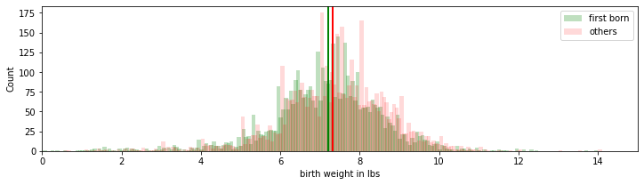

[Think Stats Chapter 2 Exercise 4](http://greenteapress.com/thinkstats2/html/thinkstats2003.html#toc24) (Cohen's d)
## The Question

Using the variable ```totalwgt_lb```, investigate whether first babies are lighter or heavier than others.

Compute Cohen’s effect size to quantify the difference between the groups. How does it compare to the difference in pregnancy length?

### Preparing the analysis
First do necessary imports:

```{python}
from __future__ import print_function, division
%matplotlib inline
import numpy as np
import nsfg
import first
import thinkstats2
import thinkplot
```


Read in the data:
```{python}
preg = nsfg.ReadFemPreg()
live = preg[preg.outcome == 1]

firsts = live[live.birthord == 1]
others = live[live.birthord != 1]
```

### Making comparisons
Compare the weights of firstborns to other babies, including the difference between.

```{python}
print("Average weight of live-born babies: ", live.totalwgt_lb.mean() )
print("Average weight of first borns:      ", firsts.totalwgt_lb.mean() )
print("Average weight of non-first-borns:  ", others.totalwgt_lb.mean() )
print("The difference in the means is:     ", others.totalwgt_lb.mean() -firsts.totalwgt_lb.mean())
```
Output:

```Average weight of live-born babies:  7.265628457623368
Average weight of first borns:       7.201094430437772
Average weight of non-first-borns:   7.325855614973262
The difference in the means is:      0.12476118453549034
```

With a small difference of **0.124** the first-born babies weigh slightly less.

Define a function to compute _Cohen's effect size_.  Allen Downey provides such code, as follows:

```{python}
def CohenEffectSize(group1, group2):
    """
    Allen Downey code, from ThinkStats:
    Computes Cohen's effect size for two groups.    
    group1: Series or DataFrame
    group2: Series or DataFrame
    returns: float if the arguments are Series;
             Series if the arguments are DataFrames
    """
    diff = group1.mean() - group2.mean()

    var1 = group1.var()
    var2 = group2.var()
    n1, n2 = len(group1), len(group2)

    pooled_var = (n1 * var1 + n2 * var2) / (n1 + n2)
    d = diff / np.sqrt(pooled_var)

    return d


cohen_effect_size_weight = CohenEffectSize( firsts.totalwgt_lb, others.totalwgt_lb)
print("Size of effect of birth order:     ", cohen_effect_size_weight)  
```
Output:
```
Size of effect of birth order:      -0.088672927072602    
```

### Visualizing
To visualize this to put it in context, let's make a histogram showing the means within the respective distributions.

```{python}
first_hist = thinkstats2.Hist(firsts.totalwgt_lb, label='first born')
other_hist = thinkstats2.Hist(others.totalwgt_lb, label='others')
width = 0.1
thinkplot.PrePlot(2)
thinkplot.figure(figsize=(12,3))
thinkplot.Hist(first_hist, align='right', width=width, alpha=.25, color = 'g')
thinkplot.Hist(other_hist, align='left', width=width, alpha=.15, color = 'r')
thinkplot.Config(xlabel='birth weight in lbs', ylabel='Count', xlim=[0, 15] )

thinkplot.axvline(x= firsts.totalwgt_lb.mean(), color = 'g', lw=2, alpha=1)
thinkplot.axvline(x= others.totalwgt_lb.mean(), color = 'r', lw=2, alpha=1)
```



### Preliminary interpretation

The dataset indicates that first babies are slightlly lighter on average. The difference in the means is only **0.125** lbs. The effect size of birth order (first vs. other) on weight is **-.0887**, which is four times more than the effect size of birth order on length of pregnancy (which is only **0.029**).

### Questioning
Nevertheless, since this analysis doesn't compare birth weights within the same family (same mother) we don't know whether the effect observed is due to differences between the mothers (or both parents). For instance, it might be that parents who have more children are slightly bigger on average, which might account for their babies being slightly larger on average. In order to find out, we can filter out the families who only had one child, examining only birthweights of babies who ultimately have siblings.

### Looking at multiple-birth mothers
Therefore use the ```multbrth``` column to isolate the subset that had multiple births, to compare these mothers' first borns to their subsequently born children.

```{python}
preg_multbrth = preg[preg.multbrth.notnull()]
live_multbrth = preg_multbrth[preg_multbrth.outcome == 1]

firsts_multb = live_multbrth[live_multbrth.birthord == 1]
others_multb = live_multbrth[live_multbrth.birthord != 1]
```

Print out the differences and look at effect size within this subset:

```{python}
print("Average weight of live-born babies: ", live_multbrth.totalwgt_lb.mean() )
print("Average weight of first borns:      ", firsts_multb.totalwgt_lb.mean() )
print("Average weight of non-first-borns:  ", others_multb.totalwgt_lb.mean() )
print("The difference in the means is:     ", others_multb.totalwgt_lb.mean() - firsts_multb.totalwgt_lb.mean())

cohen_effect_size_weight = CohenEffectSize( firsts_multb.totalwgt_lb, others_multb.totalwgt_lb)
print("Size of effect of birth order:     ", cohen_effect_size_weight)
```
Output:

```Average weight of live-born babies:  5.60625
Average weight of first borns:       5.247549019607843
Average weight of non-first-borns:   5.77408256880734
The difference in the means is:      0.5265335491994971
Size of effect of birth order:      -0.32499356615750474
```

The average birthweight of babies who ultimately have siblings is actually lower (5.6 lbs vs. 7.26) than babies in general. Among these babies (of mothers who had multiple births) the first borns weigh less (5.25 vs. 5.77 lbs). The size of the effect is much more, -0.325, than among babies in general. This is easily seen in the histogram below.

### Visualizing the birth weights from multiple-birth mothers
```{python}
first_hist_multb = thinkstats2.Hist(firsts_multb.totalwgt_lb, label='first born')
other_hist_multb = thinkstats2.Hist(others_multb.totalwgt_lb, label='others')
width = 0.15
thinkplot.PrePlot(2)
thinkplot.figure(figsize=(12,3))
thinkplot.Hist(first_hist_multb, align='right', width=width, alpha=.25, color = 'g')
thinkplot.Hist(other_hist_multb, align='left', width=width, alpha=.15, color = 'r')
thinkplot.Config(xlabel='birth weight in lbs', ylabel='Count', xlim=[0, 15] )

thinkplot.axvline(x= firsts_multb.totalwgt_lb.mean(), color = 'g', lw=2, alpha=1)
thinkplot.axvline(x= others_multb.totalwgt_lb.mean(), color = 'r', lw=2, alpha=1)
```


### Final words
Among children born to mothers who had more than one child, there's an even greater difference in the weight of first-borns compared to _subsequently born children, who are **0.53 lbs heavier**_ on average.
