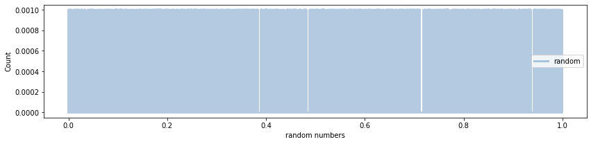
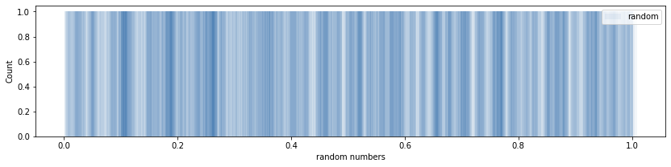
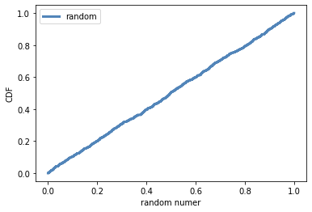

[Think Stats Chapter 4 Exercise 2](http://greenteapress.com/thinkstats2/html/thinkstats2005.html#toc41) (a random distribution)

### Question
**Exercise:** The numbers generated by `numpy.random.random` are supposed to be uniform between 0 and 1; that is, every value in the range should have the same probability.

```{python}
from __future__ import print_function, division
%matplotlib inline
import numpy as np
import thinkstats2
import thinkplot
```
Generate 1000 numbers from `numpy.random.random` and plot their PMF.  What goes wrong?

Then plot the CDF. Is the distribution uniform?

```{python}
nums = np.random.random(1000)
nums_pmf = thinkstats2.Pmf(nums, label='random')
thinkplot.figure(figsize=(14,3))
thinkplot.PrePlot(2)
thinkplot.Pmfs([nums_pmf], alpha=.3)
thinkplot.Config(xlabel='random numbers', ylabel='Count')
```


When plotting the _probability mass function_ (PMF) of 1000 random numbers there are so many values that it is difficult to tell whether the distribution is indeed uniform.

### Addressing the issue of observing the random number distribution
We can plot 300 random numbers to get a better idea, visually. Or display a histogram with transparency, which also indicates the distribution is fairly uniform.

```{python}
nums_pmf = thinkstats2.Pmf(np.random.random(300), label='random')

thinkplot.figure(figsize=(14,3))
thinkplot.PrePlot(2)
thinkplot.Pmfs([nums_pmf], alpha=.2)
thinkplot.Config(xlabel='random numbers', ylabel='Count')
```


Another approach is to view the histogram for the same distribution

```{python}
nums_hist = thinkstats2.Hist(nums, label='random')
thinkplot.figure(figsize=(14,3))
thinkplot.PrePlot(2)
thinkplot.Hist(nums_hist, align='left', width=.01, alpha=.05)
thinkplot.Config(xlabel='random numbers', ylabel='Count')
```

It looks fairly evenly distributed--at least the *un*eveness looks random; it lacks an obvious pattern.

Let's look at the _cumulative density function_ (CDF)

```{python}
nums_cdf = thinkstats2.Cdf(nums, label="random")
thinkplot.PrePlot(2)
thinkplot.Cdf(nums_cdf)
thinkplot.Config(xlabel='random numer', ylabel='CDF')
```


nums_cdf.Value(.5)

Output
 ```
0.4956510305023736
```
It is a good sign that the cumulative density at 0.5 is 0.4965, which is very close to 0.5

What about the interquartile range?
```{python}
iqr = (nums_cdf.Percentile(25), nums_cdf.Percentile(75))
iqr
```

Output
```
(0.24506198835912596, 0.7391080505225033)
```
As one would expect, the interquartile range for this randomly generated distribution ranges from
0.245 to 0.739 which is very close to the hypothetical ideal: 25% and 75%
